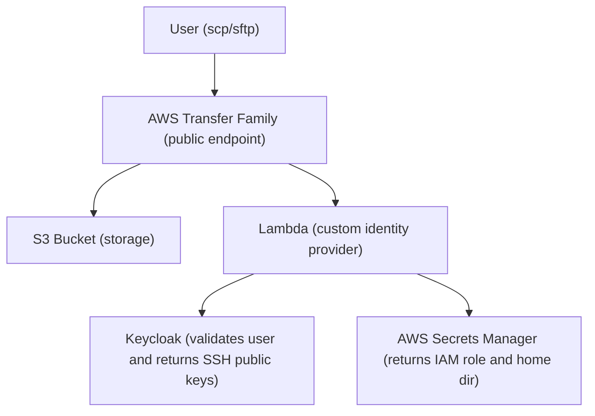

# AWS Transfer Family SFTP/SCP Server (Keycloak Integration)

Public-facing AWS Transfer Family server backed by S3, supporting SFTP and SCP protocols.
Authentication uses **SSH public keys only**, managed centrally via **Keycloak**. AWS Secrets Manager is used to store AWS-specific user configuration (IAM roles and home directories).

## Architecture



## Prerequisites

- Terraform >= 1.5.0
- AWS CLI configured with profile `YOUR_AWS_PROFILE`
- A Keycloak server (e.g., integrated with Entra ID) with:
  - A confidential client configured with Service Accounts enabled.
  - The `view-users` role assigned to the client's service account.
  - Users populated with their SSH public keys in the custom `sshPublicKey` attribute.

## Quick Start

```bash
# Copy and edit variables
cp terraform.tfvars.example terraform.tfvars
# Edit terraform.tfvars with your Keycloak and user configurations

# Deploy
terraform init
terraform plan
terraform apply
```

## Adding Users

Users authenticate purely via SSH public keys. Passwords are not supported.

1. **In Keycloak**: Add the user's SSH public key to their profile under the `sshPublicKey` custom attribute.
2. **In Terraform (`terraform.tfvars`)**: Add the user to map their Keycloak identity to an AWS S3 home directory and generate their IAM role.

```hcl
sftp_users = {
  "alice" = {
    home_directory = null  # defaults to "alice"
  }
  "bob" = {
    home_directory = "team-uploads"
  }
}
```

3. Run `terraform apply` — this creates the IAM role and Secrets Manager secret mapping for each user.

The secret is populated automatically from `terraform.tfvars`. To update directory routing outside of Terraform:

```bash
aws secretsmanager put-secret-value \
  --secret-id "sftp-external/dev/sftp-user-alice" \
  --secret-string '{
    "role_arn": "arn:aws:iam::ACCOUNT:role/sftp-external-dev-user-alice",
    "home_directory": "/BUCKET_NAME/alice"
  }' \
  --profile YOUR_AWS_PROFILE
```

## Usage

After `terraform apply`, use the endpoint from the outputs:

```bash
# SCP
scp -i ~/.ssh/id_rsa testfile.txt alice@SERVER_ENDPOINT:/testfile.txt

# SFTP
sftp -i ~/.ssh/id_rsa alice@SERVER_ENDPOINT

# Verify in S3
aws s3 ls s3://BUCKET_NAME/alice/ --profile YOUR_AWS_PROFILE
```

## Outputs

| Output | Description |
|--------|-------------|
| `transfer_server_id` | Transfer Family server ID |
| `transfer_server_endpoint` | SFTP/SCP endpoint hostname |
| `s3_bucket_name` | S3 bucket name |
| `s3_bucket_arn` | S3 bucket ARN |
| `scp_example_command` | Example SCP command |
| `sftp_example_command` | Example SFTP command |
